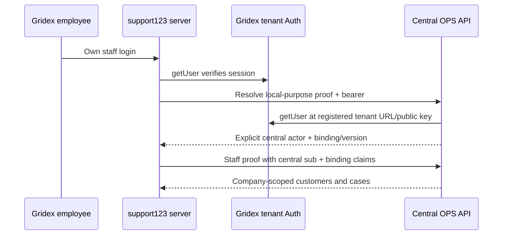

# Independent tenant staff onboarding

The additive onboarding contract is separate from the immutable Staff release
`2026-10-04.1`. Its active schema is
[`staff-onboarding-v1.json`](../openapi/staff-onboarding-v1.json), version
`2026-10-05.2`. The earlier same-database prototype is archived under
`docs/openapi/prototypes/2026-10-05.1`. Frozen Staff/Website/Customer release
bytes remain unchanged.

Gridex web and named `gridex-prod` (`ayiuxjlfazkjmmtlvhsl`) are one ordinary
external tenant. Tenant Auth and delivery durability belong there. Central
customers/cases/staff actors/membership/RBAC/audit remain in OPS. The central
API project is independently configured and attested; no OPS migration history
is copied into the tenant database. Prior catalog evidence is preserved but
its Prod-as-OPS activation interpretation is superseded.

## Identity and access



The server verifies `getUser` before reading a session bearer for transport.
Cookie user claims and user metadata grant no authority. There is no implicit
email match, local/central UUID equality fallback or cached binding admission.
The tenant Auth SDK uses a registered public key, never the OPS service Auth
client and never a caller-selected URL or tenant service key. Deleted, currently
banned, anonymous or malformed lifecycle identities are denied.

`POST /api/v1/staff-onboarding/identity/resolve` requires explicit
`staff_users.read`, closed body `{}`, verified local Auth bearer in
`x-gridex-support-auth-token`, and a fresh `staff_identity_resolution` proof.
The proof has local `sub`, company, registered issuer/audience/key, lifetime at
most 60 seconds and unused JTI. Native lookup requires the exact registered
company/client/provider/Auth issuer/local subject and current active membership.
It creates no account, invitation or grant. Its closed data contains only
`actor_user_id`, `binding_id`, `binding_version`.

Normal Staff assertions retain central actor `sub`; externally registered
clients require `token_use: staff_access`, `staff_binding_id`,
`staff_binding_version`, `local_auth_subject`, `local_auth_issuer`.
Purpose-specific local proofs cannot be exchanged for normal Staff access,
even when UUIDs collide. Every request checks current binding, client,
provider, native membership and existing permission rules. Legacy clients
without external registration retain their existing central-sub flow.

Every onboarding request expects the verified central API project through
`X-Gridex-Expected-Project-Ref`, with successful
`X-Gridex-Project-Ref` attestation. The actual captured service SDK URL is checked
before machine authentication, telemetry, rate-limit and handler access.
The expected project is never the tenant Auth project by assumption.

## Registered delivery and initial administrator

An authorized OPS operator registers an active same-company integration client
with explicit staff scopes and an active enforcing purpose=`staff` provider.
The client registration is operator-owned; browser fields cannot supply it.

```json
{
  "allowed_origins": ["https://support123.gridex.se"],
  "metadata": {
    "staff_onboarding_origin": "https://support123.gridex.se",
    "staff_tenant_auth": {
      "url": "https://ayiuxjlfazkjmmtlvhsl.supabase.co",
      "public_key": "<tenant public Auth key>"
    },
    "staff_tenant_delivery": {
      "url": "https://support123.gridex.se/api/internal/staff/invitations/deliver",
      "issuer": "<registered OPS HTTPS issuer>",
      "audience": "https://support123.gridex.se/api/internal/staff/invitations/deliver",
      "key_id": "<OPS request key id>",
      "request_public_jwk": {"kty":"RSA","kid":"<OPS request key id>","n":"<public modulus>","e":"AQAB"}
    }
  }
}
```

The exact HTTPS origin must be a literal member of `allowed_origins`. No paths,
ports, credentials, IP/local addresses or metadata-origin fallback are allowed.
Auth URL must be a canonical external Supabase project distinct from the
captured OPS project. Private material in the registered JWK is rejected. Its `kid` must equal the registered `key_id`.
The server-only OPS `GRIDEX_STAFF_DELIVERY_PRIVATE_KEY` must match that JWK;
configuration/native-readiness failure precedes invitation intent creation.

The reachable first-enrollment control is **Personalportal · första
administratören** under `/admin/companies/<verified-company-id>/users` in OPS.
A genuine OPS platform administrator explicitly selects an active registered
same-company client, recipient email/name and an assignable role. The server
action accepts no actor, company, callback, membership or metadata fields from
the form. Its company argument is validated and authorized again on every
submission; rendering the control grants no authority.

Before constructing the cookie-aware Auth client, the adapter verifies that
the public Auth configuration and actual central service SDK point to the
captured OPS project. It then checks the actual Auth and REST targets of the
same server SDK before `getUser`. That genuinely verified user must match the
same SDK's `canonical_authenticated_tenant_context` result, with explicit
current `is_platform_admin: true`, selected company and `users.write` permission.
No role name, email, user metadata or colliding tenant Auth UUID is a substitute.
Company operational eligibility and the explicitly selected company-filtered
client are checked before invoking the existing helper.

The action calls only `provisionExternalStaffBootstrapInvitation({companyId,
apiClientId, actorUserId, email, fullName?, roleKey, idempotencyKey})`; it derives
`actorUserId` from that verified OPS session. The form retains a hidden UUID
and entered values across failed submissions. The native key includes the
company and UUID; retrying the same command preserves its key, while changing
the recipient/client/role with that key conflicts. A fresh page load provides
a key for a new command. The browser receives only a pending status and safe
message, never the invitation token, acceptance URL or credentials. The control
creates no Auth account or email independently.

The service-only native wrapper
checks the current client/provider/company and uses the existing canonical
users.write/admin/role-ceiling invitation engine. It fixes the durable marker
`channel: ops`, `staff_operation: invite`, `external_staff_identity: true` and
original client; these fields alone confer no authority. Subsequent tenant
staff invitations use the normal Staff API and the same canonical engine.
No public bootstrap endpoint or automatic existing-user email linking is added.
The caller is implemented; the actual Gridex company, trusted OPS administrator,
first tenant administrator and registered production configuration still require
verification. These source checks establish none of those identities.

## One delivery owner

The original leased provisioning worker remains the sole delivery owner.
External Staff intent branches to the tenant bridge before every OPS Auth
invite/OTP/password/profile effect; ordinary OPS invitations keep their existing
flow. Prepare and record RPCs verify the original canonical company/invitation/
client binding and current processing job/lease. They never trust invitation
metadata as authority or substitute an arbitrary provider/client.

OPS prepares a distinct non-login compatibility actor because existing FKs
reference `auth.users`. That anchor has no email/phone/password/identity/session;
its staff profile can show the explicit invitation recipient and name. Guards
prevent attaching OPS login credentials or sessions. No tenant credentials,
passwords or access tokens are copied into central account rows or receipts.
A signed tenant receipt establishes the immutable issuer/local-subject mapping
and exact delivery provenance; no conflict-upsert merges an existing binding.

The tenant’s single private delivery migration creates only a private durability
registry and service-only claim/complete/Auth-recipient lookup RPCs. Claim commits
before the Auth/email provider call. A completed retry uses stored receipt data
and signs a fresh receipt; a started delivery with an unknown outcome returns
`409 delivery_indeterminate` and cannot automatically send a second email.
A trusted operator reconciles uncertainty using original ownership and actual
provider evidence. Native claim/complete validates request hash/fingerprint,
receipt tuple, local Auth FK and lifecycle. Recipient lookup selects an existing
local account for an explicitly authorized invitation only; it grants no role.

Tenant Auth must separately allow the own `/auth/invitation` callback. Registering
an API origin does not configure Auth redirects. Qualify the actual email
callback and tenant SMTP before enabling real delivery. Server configuration
for the tenant bridge is documented in the web app’s `apps/support/README.md`.

## Explicit acceptance and revocation

`POST /api/v1/staff-onboarding/invitations/accept` requires explicit
`staff_users.write`, the central expected project, verified confirmed local
Auth bearer, fresh `staff_invitation_acceptance` local-subject proof, stable
`Idempotency-Key` and closed `{invitation_token}` body. Exact native delivered
binding must match that subject, email, original invitation/client/provider.
No active membership is needed before this narrowly bound acceptance.
The employee successfully sets a first password in tenant Auth before acceptance;
a failed update makes no onboarding API request. GET grants no membership.

The new service-only external wrapper rechecks locked current authority before
calling the single existing canonical acceptance engine. Only stable central
company/invitation/actor/client/channel/idempotency fields reach canonical
receipts/audit. Memberships, roles, events and outbox have one writer. Repeated
acceptance does not reactivate a disabled membership. Legacy OPS acceptance
refuses both Staff API and explicitly marked external bootstrap invitations.

Binding revocation, client/provider deactivation and canonical staff disable
deny subsequent resolution/access. Existing native mutation guards recheck
current binding/client/provider and actor eligibility under their existing
transaction locks, including native canonical replay. HTTP admission, remote
Auth verification, JS completed-cache return and native mutation are separate
authority points; no cross-database or full-request atomicity is claimed.
Global profile writers are not globally serialized by the new wrapper.

Registered key/config rotation initially denies bound actors. The explicitly
trusted OPS-admin service-only refresh updates the configuration snapshot and
binding version while preserving actor, issuer/subject, company/client/provider
and invitation provenance; it grants no membership or role. Old versions are
rejected at the normal assertion-binding check. Native guards check current
active binding/configuration; they do not receive an incoming JWT key/version
snapshot and do not claim atomic JWT-rotation serialization across HTTP calls.

## Qualification and activation

Focused tests exercise actual RSA/JTI, actual request adapters, closed schemas,
differing Auth/actor UUIDs, early project refusal, exact source-guarded forwards,
private tenant delivery ownership and explicit no-login anchors. Embedded SQL
fixtures execute source bodies with synthetic data; they do not replace genuine
PostgreSQL 17 clean/upgrade replay, managed GoTrue schema or hosted acceptance.

The required native workflow runs
`scripts/staff-external-identity-binding-regression.sql` with ON_ERROR_STOP and
rolls back fixture effects. Corrected-source codegen, final native clean/upgrade,
application/type/lint/parity and browser gates remain mandatory. Historical
checks are never relabeled as new-source acceptance. Apply the OPS forward only
to central OPS and the private delivery migration only to tenant Prod.
No hosted migration, account, email, environment or domain changes are part of
these source checks. Operational qualification has two stages:

1. After the required source/native gates and verified company/operator/config
   prerequisites, make the independent `apps/support` deployment's registered
   HTTPS delivery POST and `/auth/invitation` callback available. Use its actual
   registered origin; an arbitrary preview hostname cannot qualify the fixed
   bridge audience. Configure tenant Auth redirect URLs and SMTP. This technical
   availability must precede the first real invitation and does not establish
   successful enrollment or ordinary staff access.
2. Use the authenticated OPS control for the verified first administrator. The
   sole leased worker delivers through the registered tenant bridge; qualify
   the actual email callback, explicit first-password update and acceptance,
   then fresh identity resolution and a real company-scoped session. Enable
   normal staff use only after these end-to-end checks. Failed or indeterminate
   delivery requires reconciliation, not an automatic second email.

Apply central OPS forwards only to OPS, and tenant private delivery SQL only
to tenant `gridex-prod`. The independently hosted Gridex customer portal keeps
its separate Customer API compatibility prerequisites: its current paired
customer identity headers are not a provider assertion. Enforcing a Customer
provider requires that portal's actual assertion integration before enabling
that customer flow; Staff proofs cannot substitute for it.
