# Gridex OPS – API- och systemgranskning, 7 oktober 2026

Aktuell samlad rapport: [alla fynd och fördjupade observationer](./ALL-FINDINGS.md). Den innehåller F1–F28, status/åtgärder och senaste deployment-, fullmakts-, kontospärrs-, databas-, effektivitets- och underhållsgranskningen. Nedanstående första granskningspass är historiskt underlag.

## Bedömning och omfattning

OPS har en väl utbyggd API-grund: versionerade OpenAPI-kontrakt, separata scopes, tenant-avgränsning, signerad personalidentitet, idempotens och automatiska kontraktskontroller. De fyra publicerade OpenAPI-dokumenten överensstämmer med denna arbetsytas dokument. Tre konkreta förbättringar bör prioriteras: läsbehörighet för tidigare externa personalidentiteter, den publika personalguiden och sammanhängande request-id i svar och loggar.

Granskningen gäller **Gridex OPS**, enligt användarens förtydligande. OPS egna Website Integration- och Customer Portal-API:er ingår; Gridex Web ingår inte. Innan förtydligandet kördes två lokala kontraktskontroller i webbrepot. De räknas inte som OPS-evidens. En senare redan förberedd web-installation avvisades av automatisk godkännandegranskning eftersom den låg utanför den förtydligade omfattningen; den återupptogs inte.

Källrevision: `1aef94be4758260e134bdc195a69312901bf8cb2`. Live-manifestet rapporterade deploymentrevision `c401ae989f8add2f73912746936ced6be2d02708`: samma dokument innebär inte samma körande applikationsrevision. Rapporten är en systeminventering med fördjupad API-/personalgranskning, **inte en fullständigt verifierad säkerhetsrevision av alla OPS-domäner**. Inga produktionskällor, migrationer, konton, e-postflöden eller externa inställningar ändrades.

## Utökad granskning: vanliga API:er och live-databas

Användarens fortsatta uppdrag är genomfört i [API-DATABASE.md](./API-DATABASE.md). Där finns Partner-webhooks dubbelautentisering, snapshotens ACL-risk, live-schema/onboardinggap, RLS-/grantkontroller och databasens prestandafynd. Tilläggets färska live- och Node 22-evidens ersätter motsvarande äldre begränsningar nedan; autentiserade produktionsoperationer och genuin DB-replay är fortsatt ej verifierade.

## Fler fynd inom API och dokumentation

[Fortsatt kontrakts- och beteendegranskning](./ADDITIONAL-API-DOCS.md) beskriver F6–F12: oförenliga Partner-responsscheman, anläggningsfakturor som kapas före resursfilter, supporthistorik utan continuation, replayprioritet och saknade Staff-signaler/kontraktsfält. Tjugo riktade fall passerade under Node 22.23.3; policyoklarheter skiljs från bekräftade fel.

## Ytterligare fynd och effektivisering

[Effektivitetsgranskningen](./EFFICIENCY-AND-FURTHER-FINDINGS.md) beskriver F13–F17 för mätdata, månadssummor och ETag samt lokalt uppmätta anropsantal för portalpaket, fullmaktsreplay och prisresolver. Tjugonio riktade fall passerade på Node 22. Produktionslatens och faktiska förbättringar har inte mätts; inga optimeringar infördes.

## Ytterligare fynd i skriv- och felflöden

[State-/felgranskningen](./STATE-FAILURE-FINDINGS.md) beskriver F18–F22. Högst prioritet har efter-commit-cleanup som kan radera en sparad fullmaktsfil; därefter idempotensstatus och adress-/profiländringar. Åtta riktade prov passerade på Node 22; hosted Storage och native transaktioner har inte fault-testats live.

## Systeminventering

| Del | Observerat | Evidens |
|---|---|---|
| Applikation | Next.js 16.3.8, React 19.2.4, TypeScript, npm | `package.json`, `tsconfig.app.json` |
| Databas och identitet | Supabase Postgres/Auth/Storage, server-side service client och tenant-hjälpare | `lib/supabase/{service,tenantDb,tenantQuery}.ts`, `supabase/config.toml` |
| Website Integration API i OPS | Kontrakt 2026-10-04.1, 59 OpenAPI-operationer | `docs/openapi/website-integration-v1.json`, `app/api/v1/website/` |
| Customer Portal API i OPS | Kontrakt 2026-10-04.1, 50 operationer | `docs/openapi/customer-portal-v1.json`, `app/api/v1/customer/` |
| Staff API | Kontrakt 2026-10-04.1, 25 operationer | `docs/openapi/staff-v1.json`, `lib/staff-api/` |
| Extern personalonboarding | Separat kontrakt 2026-10-05.2, 3 operationer | `docs/openapi/staff-onboarding-v1.json`, `lib/staff-api/{onboarding,identityResolution,identityAuthority}.ts` |
| Partner API | Separat dispatcher och kontraktsversion 2026-08-17.1 | `app/api/partner/v1/[[...path]]/route.ts`, `lib/partner-api/`, dokumentationskontrollen |
| Bakgrundsarbete | Interna workers/cron för bland annat onboarding, inbound mail, billing, pricing och Ediel | `app/api/internal/`, `app/api/cron/`, `.github/workflows/` |
| Leveranskontroller | Dokumentationsparitet, release-integritet, RBAC, migrationshistorik, clean/upgrade replay | `package.json`, `.github/workflows/ops-hardening.yml` |

Operationsantal inkluderar OpenAPI-/release-endpoints och överlapp mellan kontrakt. De ska inte summeras som unika affärsendpoints. Full operation-, versions- och skillinventering finns i `inventory.json`. Den mekaniska repoöversikten räknade 9 341 filer och cirka två miljoner rader, inklusive genererade filer och evidens; det är inte ett mått på manuellt granskad kod.

### Personalens anropskedja

```mermaid
flowchart LR
  A[Backend: API-nyckel och signerad assertion] --> B[Kontroll av lagringsprojekt]
  B --> C[API-klient: bolag, explicit scope och rate limit]
  C --> D[Staff-provider: signatur, issuer, audience, tid och JTI]
  D --> E[Extern identitetsbindning när registrering finns]
  E --> F[Aktivt medlemskap och bolagets behörigheter]
  F --> G[Handler: validering och tenant-filtrerade läsningar]
  G --> H[Native skrivskydd, idempotens och audit]
```

## Prioriterade fynd

### F1 – P2/Medium: borttagen extern registrering kan ge återgång till äldre läsflöde

**Status: bekräftad villkorad svaghet i kod och syntetiskt beteendeprov; inte reproducerad mot live-databas.**

`lib/staff-api/context.ts:131` kontrollerar extern identitetsbindning bara om API-klientens nuvarande metadata innehåller `staff_tenant_auth`. Om en operatör tar bort detta fält väljer resolvern det äldre flödet. En tidigare extern central personalidentitet med giltig assertion och aktivt medlemskap kan då få läskontext utan att den lagrade bindningen kontrolleras. Inspekterade användar-, kund- och ärendeläsningar gör ingen senare sådan kontroll.

Native skrivskydd känner däremot igen historiska externa identiteter även när registreringen har tagits bort: `supabase/migrations/20261005124901_tenant_staff_external_identity_bindings.sql:330`, med inkoppling i skrivskydden vid rad 406. Dokumentationen säger att varje begäran kontrollerar aktuell bindning: `docs/staff-api/independent-onboarding.md:54`.

**Förutsättningar:** operatörsägd registreringsmetadata har tagits bort; API-nyckel, signeringsbehörighet, provider och centralt medlemskap är fortsatt aktiva. Ingen obehörig väg att ta bort metadata påvisades. Detta är varken ett påvisat cross-tenant-fel eller åtkomst utan autentisering.

**Bevis:** `evidence/staff-lifecycle.probe.ts` använder den riktiga resolvern, riktiga RSA-signaturer och syntetiska beroenden. Registrerad klient anropar bindningskontrollen och nekas 403; samma klient med `metadata: {}` får läskontext och anropar inte kontrollen. Ett test passerade. Provet visar resolvergrenen, inte genuint lagrat produktionsläge.

**Effekt och rotorsak:** läsbehörighet kan överleva en extern bindningsavveckling när metadata raderas i stället för att hela klienten/personens medlemskap spärras. Nuvarande metadata används för att klassificera en identitet som historiskt extern eller äldre central.

**Riktad åtgärd:** låt den gemensamma resolvern identifiera bestående externa ankare/bindningar och neka saknad registrering för dessa. Behåll det äldre flödet för genuint äldre centrala identiteter. Verifiera med native test för aktiv, återkallad och raderad registrering samt äldre positiv kontroll innan driftsättning.

### F2 – P2: publik Staff-guide saknar externa bindningskrav

**Status: bekräftad dokumentationslucka.**

`docs/gridex-staff-api.md:30` och `app/developers/staff-api/page.tsx:73` beskriver en assertion med centralt `sub`. För externt registrerade klienter kräver `context.ts:131` även `token_use`, `company_id`, lokal Auth-issuer/subject och bindnings-id/version. Det publika exemplet saknar dessa och guiden länkar inte till onboardingflödet. En sådan integration kan följa guiden och ändå få `401 staff_identity_binding_invalid`.

Det korrekta externa flödet finns redan i `docs/staff-api/independent-onboarding.md:41`. Befintligt beteendetest `__tests__/staff-api-context.test.ts:49` visar nekad äldre assertion för externt registrerad klient och godkänt bundet anrop; testet ingick i den körda sviten.

**Åtgärd:** visa tydligt vilket inloggningsflöde som gäller för respektive klienttyp, länka till onboardingkontraktet och lägg till externa claims, identitetsupplösning, projektattestering och ett fungerande exempel i båda publika guidekällorna. Ändra inte frysta releasebytes.

### F3 – P2: svarets request-id skiljer sig från request-loggens id

**Status: bekräftat beteende- och spårbarhetsfel.**

`lib/staff-api/http.ts:44` skapar ett nytt id när handlern inte skickar `request_id`. `logIntegrationApiRequest` i `lib/integrations/apiAuth.ts:460` sparar däremot inkommande `x-request-id`; saknas det blir loggfältet null. `withStaffApi` förbinder inte loggen med det id kunden får i svaret. Felsvar skapar också nya id:n.

`evidence/request-id.probe.ts` kör den riktiga HTTP-wrappern med syntetisk kontext och visar ett 200-svar där body/header-id är ett annat än det id som skickas till loggfunktionen. Ett test passerade. Persistensmappningen verifierades i källan, inte mot live-telemetri.

**Effekt:** support kan inte säkert slå upp request-loggen med id:t från kundens svar. **Åtgärd:** skapa ett validerat, begränsat server-request-id en gång vid anropsgränsen; skicka samma id till svar, fel och loggning. Ett inkommande korrelations-id kan hållas separat. Testa både success/fel och saknat/ogiltigt inkommande id.

## Förbättringsförslag som inte är bevisade säkerhetsfel

| Prioritet | Förslag | Underlag och nytta |
|---|---|---|
| P3 | Gemensam query-parser | Users väljer sista dubblettvärdet, cases första, customers nekar dubbletter. Cases `Number` godtar exempelvis `0x10` och `1e1`; customers kräver decimal form. Enhetliga regler ger enklare integrationer. `lib/staff-api/{userHandlers,caseHandlers,customerHandlers}.ts`. Ingen dokumenterad regel om dubbletter har visats brytas. |
| P3 | Uppdatera repoingång och API-minne | `README.md` beskriver en hotfix från juli; `.agent-memory/api-contracts.md:16` anger 2026-08-05.2 och listar två kontrakt. Aktuellt system har fler kontrakt och senare versioner. Behåll historik med tydliga datum och länka aktuell källsanning. |
| P3 | Utöka prestandakontrollen till Staff-domänen | `scripts/check-n-plus-one-query-budget.cjs` skannar `app/api/v1`, customer-portal, pricing och website, men inte `lib/staff-api` eller `lib/tenant/staffCommands.ts`. Grön kontroll bevisar inte frånvaro av N+1 i dessa hjälpfunktioner. |
| P3 | Mät Staff-autentiseringens steg och p95/p99 | SLO-konfiguration och paginerade läsningar finns. Produktionslatens och databasplaner har inte mätts i denna granskning. Lägg till säkra stegvisa timings och mät före eventuell parallellisering; cachea inte behörigheter mellan säkerhetsgränser. |
| P3 | Gör separat onboardingkontrakt lätt att hitta | Onboarding är avsiktligt separat från frysta Staff-releasen. Länka dess kontrakt tydligt i utvecklaringången utan att skriva om releasehistoriken. |

## Tenant- och ägarmatris

| Resurs/gräns | Kontroll i inspekterad kod | Verifieringsnivå |
|---|---|---|
| API-klient/bolag | Bolag från verifierad klient; explicita staff-scopes krävs även vid wildcard | Kod + resolver-/maskinautentiseringstester |
| Personalidentitet | Signatur, provider, issuer/audience, tidsclaims, UUID, unik bolagsbunden JTI | Kod + riktiga RSA/JTI-tester med syntetiska portar |
| Personalbehörighet | Aktivt bolagsmedlemskap, aktivt globalt konto, bolagets overrides; deny vinner | Kod, SQL-källor och tester; live ACL ej kontrollerad |
| Extern bindning | Aktuell bindning för registrerade klienter; native återkontroll vid skrivning | Kod/prov; F1 gäller borttagen registrering i läsflödet |
| Kund | Opaque bolagsbunden referens och ytterligare bolagsfiltrerad läsning | `lib/staff-api/customers.ts`, kundtester |
| Ärende/events | Bolag/kund/ärende-filter, avgränsade supportärenden och bundna cursors | `lib/staff-api/cases.ts`, ärendetester |
| Bilaga | Ärendets ägare, MIME/storlek, innehållskontroll, release-status och hash | Handler/domainkod och tester; verklig Storage/RLS ej körd |
| Användarändring | Bolagsbunden målperson, aktör/klient återkontrolleras; rolltak och sista admin skyddas | Kod/native SQL/regressioner; genuin PostgreSQL-replay ej körd |
| Lagringsprojekt | Fel förväntat projekt nekas före auth/rate-limit/audit/handler | `storageTarget.ts`, storage-target-tester |

## Avfärdade misstankar och kvarvarande osäkerhet

- Separat onboarding saknas i frysta release-manifestet **avsiktligt**; ingen påvisad releasebugg.
- Staff-kundernas identity-change reason-längd valideras nedströms i `lib/customer-service/identityChange.ts:242`; ingen saknad längdkontroll.
- Service-role/SECURITY DEFINER är inte i sig bevis för tenantläcka. Inspekterade skrivskydd har uttryckliga aktör/klient/bolagsvillkor och begränsade grants.
- Rå dependency-audit hittade ett high-advisory för `node-forge`, GHSA-86w9-cpqp-85rv. Befintligt tidsbegränsat undantag gäller till **1 november 2026**. Undantaget gäller RSA-signaturverifiering; inspekterade forge-anrop gäller CMS enveloped-data/PKCS#12 och certifikatparsning, inte den berörda forge-verifieringen. Projektets production-gate passerar med undantaget; råa fyndet är fortfarande öppet hos upstream och bör följas upp.
- Två första testfel var `spawnSync ... EPERM`, inte en verifierad API-defekt. Båda passerade vid en avgränsad körning utanför subprocess-begränsningen.
- Inget cross-tenant- eller oautentiserat Staff-intrång bekräftades i granskad kedja. Detta är ingen generell garanti för hela OPS.

## Verifieringsmatris

Alla nedanstående kontroller kördes under denna granskning. Lokal Node var **24.19.0**; projektets stödda releaseversion är **Node 22**. Resultaten är diagnostisk evidens och ersätter inte Node 22 release/CI-gater.

| Kommando/kontroll | Resultat |
|---|---|
| `npm ci --ignore-scripts --no-audit --no-fund --cache /tmp/gridex-audit-npm-cache` | PASS i OPS, 471 paket; Node-enginevarning |
| `npm run api:docs` | PASS: 108 route-filer, 116 registry-rader, 137 OpenAPI-operationer; versioner/exempel/komponenter/runtime-fixture |
| `npm run api:release:verify` | PASS lokala aktuella och immutabla releaseartefakter |
| `npm run api:error-registry` | PASS, 24 gemensamma registrerade felkoder; inte en full inventering av alla domänfel |
| `npm run api:performance-tenant-gates` | PASS statiska regler; inte verklig RLS- eller lastverifiering |
| `npm run quality:n-plus-one` | PASS inom scriptets uttryckliga källrötter |
| `npm run quality:slo-contract` | PASS konfigurering av sex last-/ETag-profiler; ingen last körd |
| `npm run db:migrations:check` | PASS, 1 095 SQL-filer/998 versionsgrupper/checksums samt genererade typer |
| `npm run security:rbac` | PASS, 24 kontroller, 0 varningar |
| `npm run typecheck` | PASS, app-TypeScript |
| `npx --no-install vitest run __tests__/staff-*.test.ts __tests__/tenant-staff-delivery.test.ts __tests__/external-staff-enrollment-admin.test.ts __tests__/tenantservice-customer-assertion.test.ts __tests__/tenantservice-customer-assertion-openapi.test.ts __tests__/api-canonical-release.test.ts __tests__/openapi-release-metadata.test.ts __tests__/public-contract-route-openapi-regression.test.ts` | Först 656 PASS/2 subprocess-blockerade av 658 i 53 filer |
| `npx --no-install vitest run __tests__/staff-api-openapi.test.ts __tests__/staff-user-rbac-audit.test.ts` | Avgränsad omkörning PASS, 31/31; täcker båda tidigare blockerade fallen. Alla 658 ursprungliga fall har därmed passerat |
| Temporära `staff-lifecycle-review-probe-20261007.test.ts` och `ops-api-request-id-review-probe-20261007.test.ts` | Varsitt syntetiskt beteendeprov PASS; exakt källa bevarad i evidence, temporära suite-filer borttagna |
| `npm audit --omit=dev --json --cache /tmp/gridex-audit-npm-cache` | 1 high-advisory för node-forge, inget annat rapporterat |
| `GRIDEX_AUDIT_ATTEMPTS=1 GRIDEX_AUDIT_TIMEOUT_MS=45000 npm_config_cache=/tmp/gridex-audit-npm-cache npm run security:audit-production` | PASS med befintligt node-forge-undantag |
| GET publicerat manifest + fyra aktuella specs | HTTP 200, JSON; alla fyra semantiskt identiska med lokala specs; manifestets tre SHA256 stämmer |

Bevarade resultat: `evidence/`. Livekontrollen använde endast publika GET-anrop, inga API-nycklar eller kunduppgifter.

### Ej verifierat / begränsat

- Genuin PostgreSQL 17 clean/upgrade replay, live grants/RLS, produktionsmigrationsläge och autentiserade produktionsoperationer. Ingen sådan DB-kvalificering kördes.
- Full app-testsvit, Node 22 releasekörning, lint/build/browser och verklig invitation/SMTP/callback.
- Partner-handlers, Ediel, billing och andra domäner inventerades men genomgick inte samma djupa kompletta beteenderevision som personalgränsen.
- Full Semgrep/CodeQL-analys och GitGuardian secret/history scan kördes inte. Verktygen saknades i miljön; inga motsvarande "säkerhetsren"-anspråk görs. Ingen egen regex-secretscanner användes.
- Hela Quality Playbook-flödet inklusive formell kravgenerering/multimodellgranskning kördes inte. De installerade instruktionerna konsulterades; denna rapport ersätter inte det arbetsflödet.
- Inga verkliga p50/p95/p99 eller EXPLAIN ANALYZE-data samlades in.

## Open source-skills att använda

Det finns redan **42 skills i `skills-lock.json` och 45 skillkataloger**. De tre ytterligare lokala katalogerna är `browser-e2e`, `full-e2e-verification`, `gridex-tenant-e2e`; detta är en inventeringsskillnad, inte i sig en försörjningskedjesårbarhet.

| Källa | Befintliga användbara skills | Praktisk användning i OPS |
|---|---|---|
| [Trail of Bits](https://github.com/trailofbits/skills) | spec-to-code-compliance, fp-check, sharp-edges, property-based-testing, codeql | Kontrakt mot verkligt beteende, motbevisa misstänkta fel, säker API-design, parser-/cursor-/idempotensinvarianter |
| [Supabase](https://github.com/supabase/agent-skills) | supabase, supabase-postgres-best-practices | Tenant/RLS/grants/RPC och uppmätt databasprestanda |
| [Sentry](https://github.com/getsentry/skills) | code-review, find-bugs, code-simplifier | Små API-PR:er, felkedjor och förenkling efter beteendebevis |
| [Superpowers](https://github.com/obra/superpowers) | writing-plans, systematic-debugging, verification-before-completion | Avgränsade förbättringar med verifiering och tydlig överlämning |
| [Semgrep](https://github.com/semgrep/skills) | code-security, semgrep | Automatiserade regler som kompletterar manuella auth-/tenant-granskningar |
| [Addy Osmani](https://github.com/addyosmani/agent-skills) | performance-optimization, observability-and-instrumentation | Mät och förbättra latens utan att försvaga behörighetskontroller |
| [GitHub Awesome Copilot](https://github.com/github/awesome-copilot) | acquire-codebase-knowledge, quality-playbook, threat-model-analyst | Systemkartor och större periodiska granskningar |
| [OpenAI Skills](https://github.com/openai/skills) | security-threat-model | Dokumenterad hotmodell för portal, API-nyckel, signeringsnyckel och privilegierade workers |

**Rekommendation:** använd i första hand det som redan finns. Prioritera kontraktskontroll + fp-check + Supabase + kodgranskning vid API-ändringar; välj prestandaskills när det finns mätdata. Fler installerade skills ger inte automatiskt bättre resultat. Kontrollera respektive upstream-licens och fast revision vid uppdatering; skillkällor och hashes finns i inventory. Lokal Quality Playbook och security-threat-model innehåller LICENSE-filer; full licensinventering av alla upstream-paket gjordes inte.

Kompletterande öppna **verktyg, inte skills**, kan vara [Spectral](https://github.com/stoplightio/spectral) för OpenAPI-regler, [oasdiff](https://github.com/oasdiff/oasdiff) för breaking-change-diff och [Schemathesis](https://github.com/schemathesis/schemathesis) för genererade kontraktstester. Utvärdera dem mot befintliga kontroller i en disponibel testmiljö; de installerades inte och kördes inte här. Schemathesis ska inte köras blint mot produktionsskrivningar.

## Små föreslagna PR:er

1. **Personalens historiska identitetsklassificering:** F1. Negativa läsprov efter registreringsborttagning/revokering, positivt legacy-prov och native DB-bevis. Bevara aktiv provider-, medlemskaps- och scopekontroll.
2. **Publik onboardingguide:** F2. Båda guidekällor, externa claims/exempel, länkar och kontraktsval; kontrollera exempel mot verkliga request-adaptrar och `api:docs`. Frysta specs förblir frysta.
3. **Ett request-id genom Staff-flödet:** F3. Success/fel/header/body/telemetri, hantering av ogiltiga inkommande id:n, ingen känslig payload i loggar.
4. **Query-regler och aktualiserad systemingång:** delade regler med små beteendeprov för dubbletter/numeriska former; uppdatera aktuell API-ingång och datum i dokumentation med respekt för andra kampanjers minnesägarskap.
5. **Uppmätt Staff-prestanda och CI:** utöka scanrötter, samla säkra stage-timings och lastdata i verifierad testmiljö; föreslå sedan optimering endast där baslinjen visar ett problem.

Varje kod-PR behöver relevant Node 22-, kontrakts-, native- och CI-kvalificering före eventuell leverans. Denna användarförfrågan gällde granskning och förbättringsförslag; inga remediation-PR:er eller produktionsändringar gjordes.
